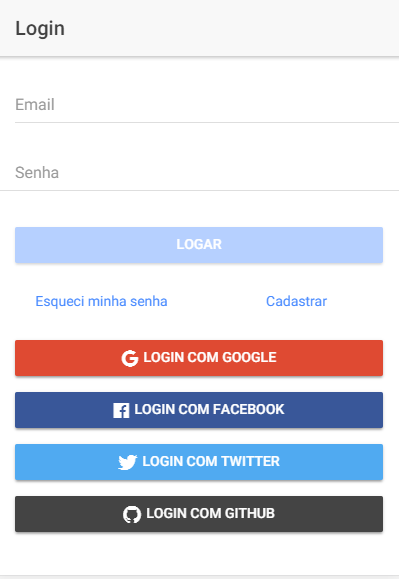
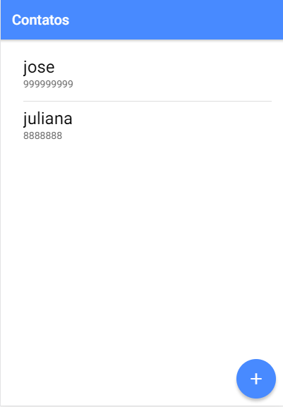
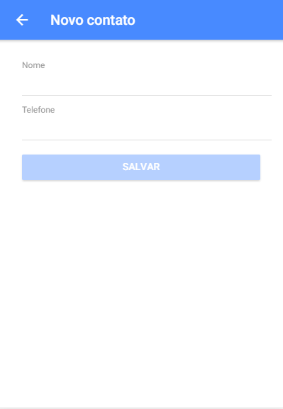
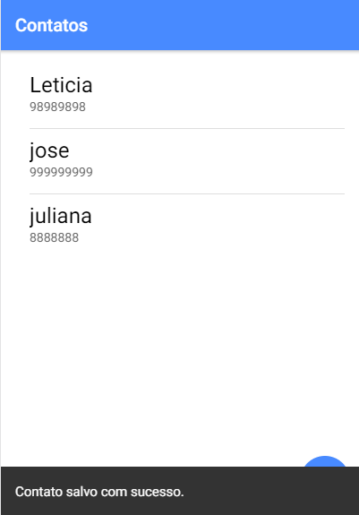

# APP Contatos com Ionic

Projeto de um APP de Contatos usando o Framework Ionic com banco de dados Firebase.

## Características

- AuthModules
- Cadastro de Usuários
- Login com E-mail, Google, Facebook, Twitter ou GitHub
- CRUD Contatos

## Tecnologias

- Ionic
- AngularJS
- TypeScript
- NodeJS
- Firebase

## Instalação

Rode o comando abaixo para instalar as dependências:

```bash
$ npm install
```

Após, rode o projeto no navegador

```bash
$ ionic serve
```

Ou rode no seu sistema

Android

```bash
$ ionic cordova platform add android
$ ionic cordova run android
```

iOS

```bash
$ ionic cordova platform add ios
$ ionic cordova run ios
```

## License

APP Contato está licenciado sobre <a href="LICENSE">The MIT License (MIT)</a>.

## Screenshots

<br><br>
<br><br>
<br><br>
<br><br>
